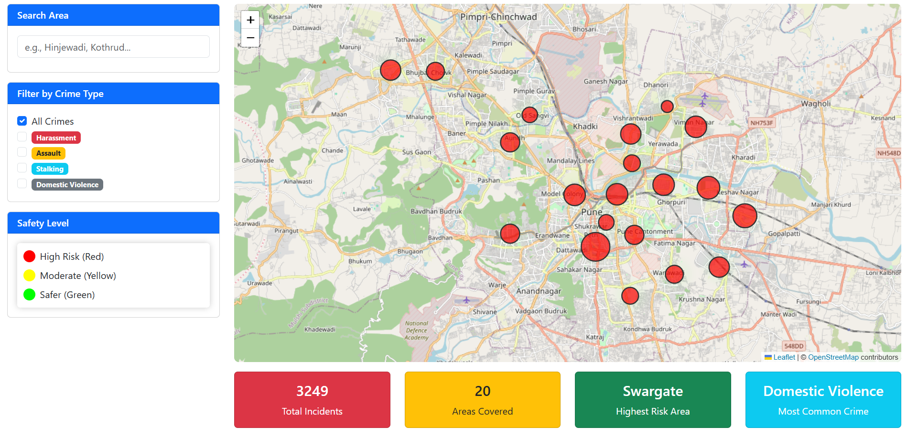

# Pune Women's Safety Map

An interactive web application visualizing crime statistics against women across different areas of Pune, India. Data is sourced from NCRB (National Crime Records Bureau) 2023.

## Project Structure

```
women_safety_map/
├── index.html          # Main frontend (Leaflet map + Bootstrap UI)
├── script.js           # Frontend JavaScript (map interactions)
├── app.py              # Flask backend API
├── process_data.py     # Data processor (generates data.json)
├── data.json           # Processed crime data (generated)
├── raw_data.xlsx       # Source data from NCRB
├── crime_head_wise.pdf # NCRB crime categorization reference
├── requirements.txt    # Python dependencies
└── README.md
```

## Quick Start

### 1. Install Dependencies
```bash
pip install -r requirements.txt
```

### 2. Generate Data
```bash
python process_data.py
```

### 3. Run the Application
```bash
python app.py
```

Open [http://localhost:5000](http://localhost:5000) in your browser.

## Screenshot



## Features

- **Interactive Map** - Leaflet heatmap showing crime concentration across Pune
- **Area Search** - Find specific neighborhoods (Hinjewadi, Kothrud, etc.)
- **Crime Type Filter** - Filter by harassment, assault, stalking, domestic violence
- **Statistics Dashboard** - Total incidents, areas covered, highest risk areas
- **Risk Level Legend** - Color-coded safety indicators (Red/Yellow/Green)

## API Endpoints

| Endpoint | Description |
|----------|-------------|
| `GET /api/crimes` | All crime data |
| `GET /api/crimes?area=X` | Filter by area |
| `GET /api/stats` | Aggregated statistics |
| `GET /api/areas` | List of all areas |
| `GET /api/types` | Crime type definitions |
| `GET /api/search?q=X` | Search areas by name |
| `GET /api/predict?area=X` | Risk level prediction |

## Data Source

- **Total Pune crimes**: NCRB 2023 (2,550 cases)
- **Crime type proportions**: Estimated from Maharashtra patterns
- **Disclaimer**: For awareness purposes only. Data is approximate.

## Tech Stack

- **Frontend**: HTML5, Bootstrap 5, Leaflet.js, Leaflet.heat
- **Backend**: Flask, Flask-CORS
- **Data**: JSON (generated from NCRB statistics)
